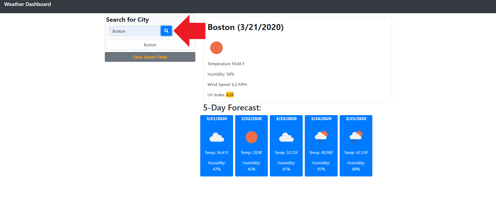
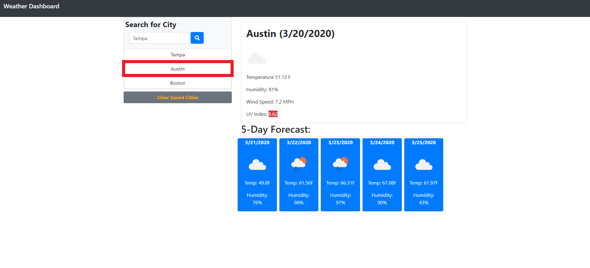
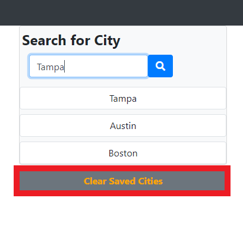

# 06 Server-Side APIs: Weather Dashboard
## Description
Weather Dashboard using jQuery, CSS Bootstrap, and Open Weather API.
 

This project was heavily run through jQuery functions and AJAX calls in order to grab current weather information from the Open Weather API sources. There were three API sources I used in order to reach the user's acceptance criteria: Current Weather, 5-Day Weather Forecast, and UV Index. Through a combination of AJAX calls, epoch-to-readable date translations, and general jQuery functionality, I was able to create a Weather Dashboard which searches for a city and displays it's current weather and 5-day forecast, generates a button corresponding to that city which would append the city's data again, stores the city buttons locally, and a button to clear the local storage.

 

The page is set up fairly straight forward. Enter a city's name in the search box and either hit Enter or click the Search button. This will send the AJAx call to Open Weather API, gather the current weather for that city, and display it in the card to the right hand side.

 

 
<b>When a city is searched:</b>

 

 After a city is searched, a button is created with the search input displayed. These buttons are locally stored and will rerun the function to retrieve the city's weather data when clicked. Also, notice the UV Index's span changes color depending on how high the measurement is.

 

 

I have also added a button to clear the search history (the city buttons) and remove them from localstorage. This is just to have a clean application and friendly user interface.

 
<b>Before the Clear button is clicked:</b>

 
<b>After the Clear button is clicked:</b>

 

Overall, this project came out quite nicely. The functionality is smooth, images and data are displayed dyynamically, and the responsive design is near perfect. There are areas withing the Javascript file where added tools may have made for easier, more efficient, or errorless code, but I will focus on cleaning that up later.

 
## License
MIT License

Copyright (c) [2020] [DrakeDeMuyt]

Permission is hereby granted, free of charge, to any person obtaining a copy
of this software and associated documentation files (the "Software"), to deal
in the Software without restriction, including without limitation the rights
to use, copy, modify, merge, publish, distribute, sublicense, and/or sell
copies of the Software, and to permit persons to whom the Software is
furnished to do so, subject to the following conditions:

The above copyright notice and this permission notice shall be included in all
copies or substantial portions of the Software.

THE SOFTWARE IS PROVIDED "AS IS", WITHOUT WARRANTY OF ANY KIND, EXPRESS OR
IMPLIED, INCLUDING BUT NOT LIMITED TO THE WARRANTIES OF MERCHANTABILITY,
FITNESS FOR A PARTICULAR PURPOSE AND NONINFRINGEMENT. IN NO EVENT SHALL THE
AUTHORS OR COPYRIGHT HOLDERS BE LIABLE FOR ANY CLAIM, DAMAGES OR OTHER
LIABILITY, WHETHER IN AN ACTION OF CONTRACT, TORT OR OTHERWISE, ARISING FROM,
OUT OF OR IN CONNECTION WITH THE SOFTWARE OR THE USE OR OTHER DEALINGS IN THE
SOFTWARE.
